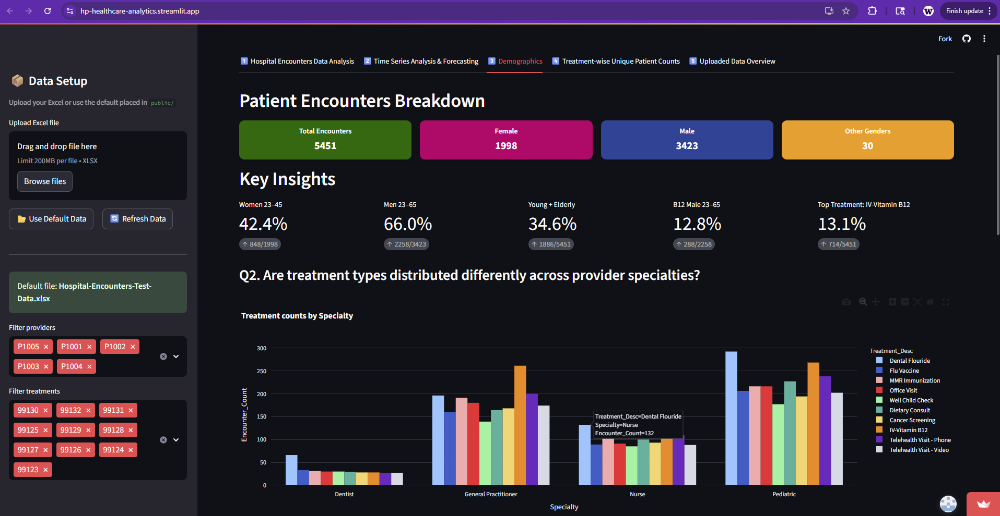
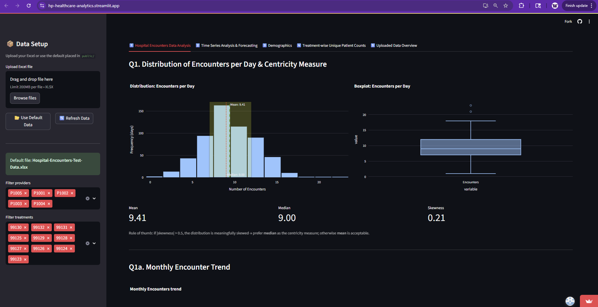
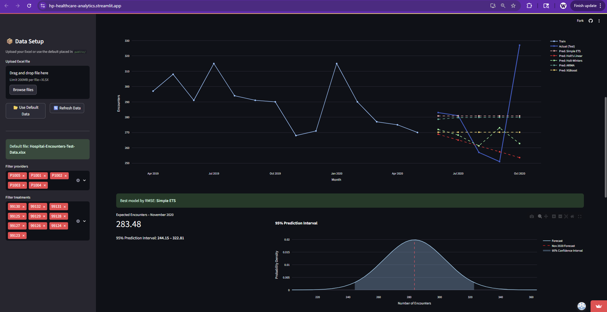

# Healthcare Analytics – Patient Encounters & Forecasts

A **dynamic app** that enables interactive exploration of patient encounters and treatment trends. Users can filter by providers and treatments, visualize demographic insights, and track time series trends and forecasts for key metrics, all in an intuitive dashboard interface.

---

## 🚀 Features

- **Upload or Use Default Data:** Upload your Excel file or use the default dataset provided.
- **Interactive Filtering:** Filter encounters by providers and treatments in the sidebar.
- **Patient Demographics:** Explore gender, age group, and other key demographic insights.
- **Treatment Analysis:** View treatment-wise unique patient counts across age groups.
- **Time Series Forecasting:** Forecast patient encounters using methods like ETS, Holt’s Linear, Holt-Winters, ARIMA, and optionally XGBoost.
- **Visualizations:** Histograms, boxplots, line charts, and metric tiles for easy interpretation.

---

## 🌐 Try it Out

Check out the live app here: [HP Healthcare Analytics](https://hp-healthcare-analytics.streamlit.app/)  

---

## 🗂 Overview of Uploaded DataFrames

### Dim.Treatment
- **Columns:**
  1. `Treatment_ID`
  2. `Treatment_Desc`

### Dim.Physician
- **Columns:**
  1. `Physician_ID`
  2. `Specialty`

### Dim.Patient
- **Columns:**
  1. `Patient_ID`
  2. `Patient_Age`
  3. `Gender_at_Birth`

### EncounterFact
- **Columns:**
  1. `Encounter_Number`
  2. `Date_of_Service`
  3. `Patient_ID`
  4. `Treatment_ID`
  5. `Provider_ID`

---
## 🖼 Screenshots

### 1️⃣ Demographics & Key Insights

### 2️⃣ Patient Encounters

### 3️⃣ Time Series Forecasting

---

## ⚙️ Dependencies

- Python 3.9+
- [Streamlit](https://streamlit.io/)
- Pandas, NumPy
- Plotly
- Statsmodels (for forecasting)
- Scikit-learn
